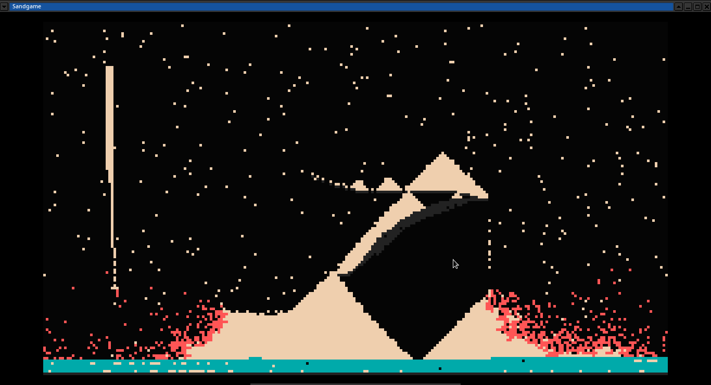

# sandgame
Falling sand demo in Rust.

Hastily ported from a small Lua demo before I knew about iterators. Single-buffered, interactions run from bottom-right of screen to top-left.

Uses [Pixels](https://github.com/parasyte/pixels) for rendering.

# Gameplay

# Controls
Button | Function
--- | --------
**Left Click**| Draw particles
**Space** | Pause/unpause simulation
**Arrow Keys** | Move sand shower
**Numbers 1-4** | Draw with sand, wall, fire or water
**+ or -** | Increase/decrease drawing size
**Escape** | Quit the game

# Elements
Element | Description
-------|--------
**Air**| Exists.
**Sand**| Falls, forms piles.
**Wall**| Static, collides.
**Fire**| Burns sand... even though sand isn't really flammable?
**Water**| Doesn't work.